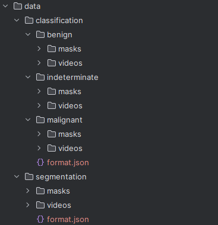

# AdrenalTumorDetectorClasifier
НИР "Диагностика заболеваний (образований) надпочечников с помощью ИИ"

### branch - ```feature_preprocessing```

Ветка предподготовки данных.


1. Для создания датасета, необходимо добавить .xlsx файл таблицы с ссылками на
папки с видео и масками датасета в корень проекта
2. Запустить скрипт ```prepare_kaggle_dataset.py```. По мере работы скрипта 
сформируются 2 вспомогательных файла:
   - ```direct_links.csv``` файл с прямыми ссылками на скачивание видео и масок
   - ```dataframe.csv``` файл с со всей метаинформацией к каждому видео
3. В результате будет сформирован .zip архив, который используется как
датасет


Структура папок в датасете:

data/

Датасет разделен на две части для обучения классификатора и для обучения
сегментатора. 

Вся метаинформация и пути к файлам для обучения собраны в ```format.json```

Пример метаданных:
```commandline
{
     "id":1,
     "type":"\/malignant",
     "video_path":"data\/classification\/malignant\/videos\/ID1_NATIVE_SE1.npy",
     "mask_path":"data\/classification\/malignant\/masks\/ID1_NATIVE_SE1_MASK_LEFT.npy",
     "diagnosis":"рак",
     "localization":"слева",
     "phase":"native"
}
```


